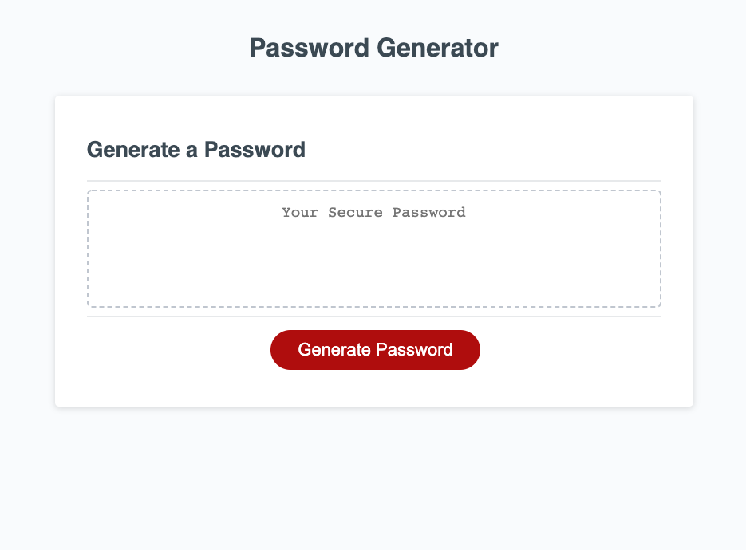

# password-generator

* password-generator is an interactive site that will take in user parameters of password length and type of characters before providing a randomized password.

* To use the generator, click the button that says "Generate Password" and follow the prompts. 

* See page: [Password Generator](https://caitlinw29.github.io/password-generator/)
